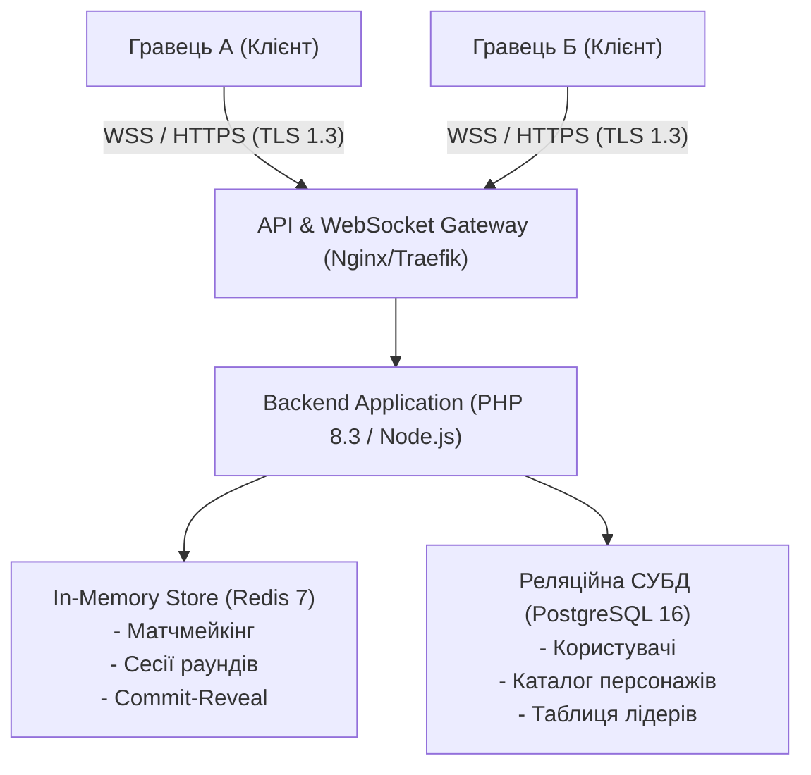
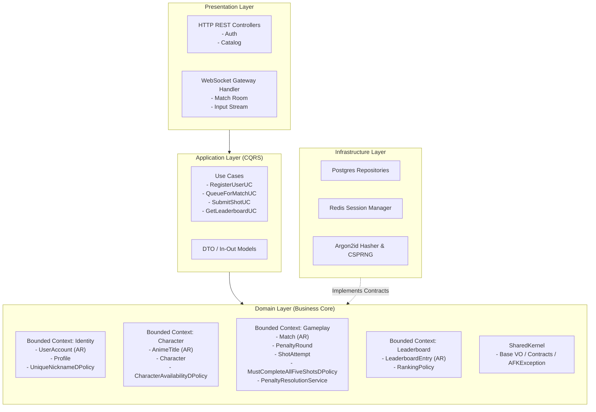
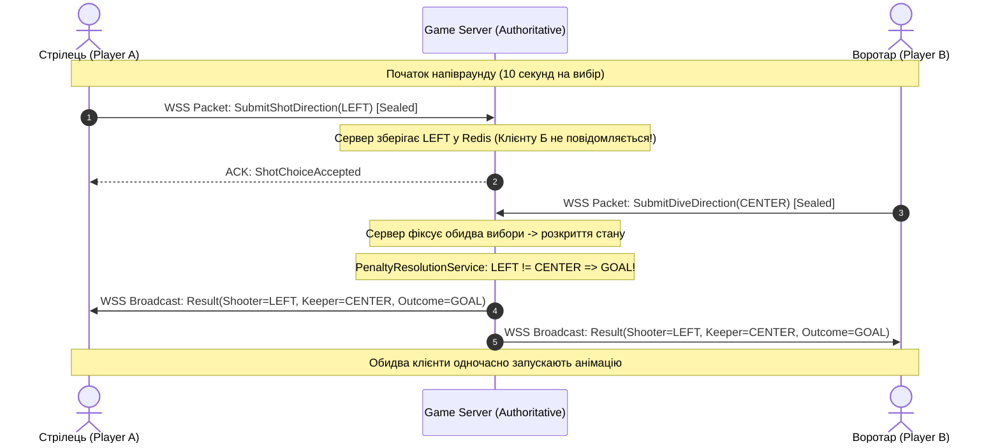
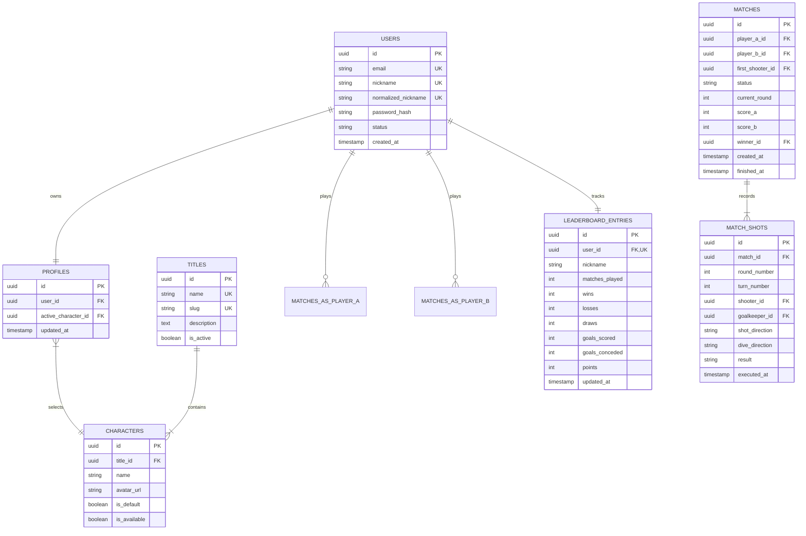

# Опис архітектури системи (Architecture Description) — Freekick

**Відповідно до положень міжнародного стандарту ISO/IEC/IEEE 42010:2022**

| | |
| --- | --- |
| **Документ** | Architecture Description (AD) |
| **Система** | Freekick — Онлайн-гра "Пенальті" з аніме-персонажами |
| **Версія** | 1.0.0 |
| **Дата створення** | 2026-10-03 |
| **Статус** | Approved / Architecture Baseline |
| **Автор** | Mykhailo Zaporozhchenko |

---

## 1. Ідентифікація архітектури та контекст (Identification & Context)

Система **«Freekick»** являє собою розподілений багатокористувацький програмний комплекс реального часу, спроектований за принципами предметно-орієнтованого проектування (Domain-Driven Design), гексагональної архітектури (Ports & Adapters) та моделі абсолютного авторитету сервера (Server-Authoritative).

Документ складено з дотриманням положень стандарту **ISO/IEC/IEEE 42010:2022** (*Software, systems and enterprise — Architecture description*).

---

## 2. Зацікавлені сторони та їхні інтереси (Stakeholders & Concerns)

| Зацікавлена сторона | Роль | Ключові архітектурні інтереси (Concerns) |
|---|---|---|
| **Гравці (Players)** | Кінцеві користувачі | Чесність гри (Anti-Cheat), миттєвий відгук (низький пінг), привабливий вибір аніме-персонажів, точність таблиці лідерів. |
| **Офіцер безпеки (Security Auditor)** | Контроль ризиків | Надійність криптографічного захисту (Argon2id), захищеність від перехоплення вибору (Anti-sniffing), запобігання ін'єкціям та підробці ігрових результатів. |
| **Розробник / Архітектор (Software Engineer)** | Супровід системи | Чистота коду, дотримання SOLID та DDD, тестованість компонентів, відсутність протікання фреймворку в доменні моделі. |
| **Системний адміністратор (DevOps)** | Експлуатація | Стабільність сокетних сесій, мінімальне навантаження на БД завдяки кешуванню Redis, простота контейнеризації через Docker. |

---

## 3. Архітектурні точки зору та представлення (Architecture Views)

### 3.1. Системний контекст (Context View)

Система Freekick взаємодіє з гравцями через захищені канали HTTPS та WSS (TLS 1.3):

---

### 3.2. Функціональне представлення (Functional & Domain View)

Внутрішня організація слідує шарам Clean Architecture / Hexagonal Architecture:

---

### 3.3. Представлення безпеки (Security & Trust View)

#### 3.3.1. Межі довіри (Trust Boundaries)
1. **Зовнішня зона (Untrusted):** Клієнтський додаток. Клієнт вважається скомпрометованим за замовчуванням. Жодна бізнес-перевірка не делегується клієнту.
2. **DMZ / Мережевий шлюз:** TLS Termination, перевірка лімітів запитів (Rate Limiting).
3. **Внутрішня захищена зона (Trusted):** Бекенд-сервер, процесор доменної логіки, приватні шини Redis та PostgreSQL.

#### 3.3.2. Схема захисту від аналізу пакетів (Anti-Sniffing Commit-Reveal)
Для унеможливлення підглядання вибору напрямку удару/сейву сервер реалізує запечатану обробку:

---

### 3.4. Інформаційне представлення (Data / Information View)

Схема реляційних зв'язків у PostgreSQL:

---

## 4. Журнал архітектурних рішень (Architecture Decision Records — ADR)

### ADR-001: Архітектура абсолютного авторитету сервера (Server-Authoritative Game Logic)
- **Контекст:** Гра є змагальною онлайн-дуеллю 1v1. Якщо клієнт самостійно визначатиме факт взяття воріт, гравці зможуть модифікувати клієнт для гарантованих перемог.
- **Рішення:** Всі правила гри, черговість ударів, детекція голів/сейвів та оновлення статистики реалізовані виключно на бекенді. Клієнт є суто інструментом відображення (View) та введення ходів.
- **Наслідки:** 100% захист від читерства на рівні клієнта; незначне навантаження на обчислювальні ресурси сервера.

### ADR-002: Обов'язковість завершення всіх 5 раундів (10 ударів)
- **Контекст:** У класичному футболі серія пенальті зупиняється, якщо одна сторона математично відірвалася (наприклад, 3:0 після 3 ударів). Проте у Freekick глобальна таблиця лідерів враховує не лише перемоги, а й різницю м'ячів, загальну кількість забитих та пропущених голів.
- **Рішення:** На рівні доменної політики `MustCompleteAllFiveShotsDPolicy` зафіксовано обов'язкове виконання всіх 5 ударів кожним гравцем за будь-якого поточного рахунку.
- **Наслідки:** Забезпечується максимальна статистична справедливість у таблиці лідерів; підвищується спортивний азарт гравців пробивати серію до кінця.

### ADR-003: Використання Argon2id для хешування паролів
- **Контекст:** Дисципліна «Безпека програм та даних» вимагає застосування сучасних стандартів криптографічного захисту персональних даних.
- **Рішення:** Паролі користувачів хешуються алгоритмом Argon2id ($m=65536, t=3, p=1$) з індивідуальною випадковою сіллю.
- **Наслідки:** Забезпечується найвищий рівень захисту від перебору за словником та атак із застосуванням GPU/FPGA.

### ADR-004: Схема одночасного запечатаного вводу (Commit-Reveal Anti-Sniffing)
- **Контекст:** Якщо передавати вибір напрямку снайпера відкритим текстом на клієнт воротаря, зловмисник зможе аналізувати мережеві сокети Wireshark-подібними утилітами і завжди парирувати удари.
- **Рішення:** Сервер збирає вибори обох гравців асинхронно у пам'яті (Redis) і оприлюднює результат одночасно обом учасникам лише після фіксації обох пакетів або після спливу таймера раунду.
- **Наслідки:** Повна неможливість сніфінгу вибору суперника під час фази удару.
